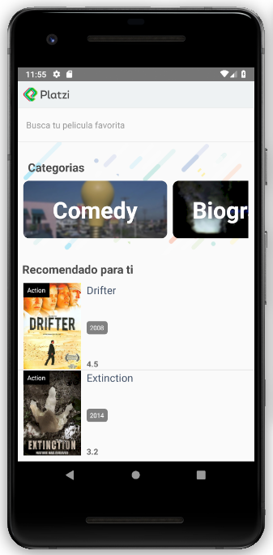
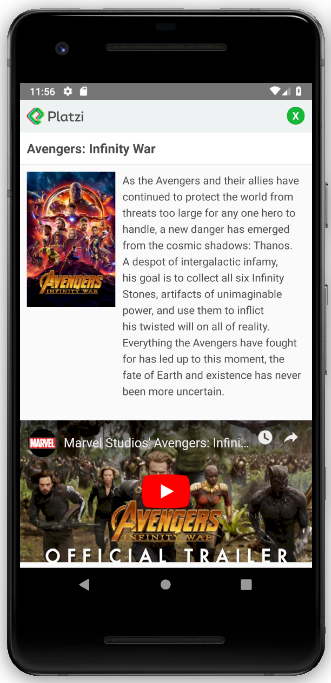

# Platzi Video
                

Aplicación desarrollada en React Native que utiliza la API de YTS.lt  para mostrar un amplio catalogo de películas, tanto nuevas como clásicas, en las que ofrece una breve reseña sobre la película, y su respectivo trailer. Algunas de las features que tiene son:

* Utilización de Redux para manejar la capa de datos de la aplicación

## Scripts

* `npm install` para instalar las dependencias
* `react-native run-android` para correr en un emulador android
* `react-native run-ios` para correr en un emulador ios

## Licencia

MIT

This project was bootstrapped with [Create React App]
(https://github.com/facebookincubator/create-react-app).
